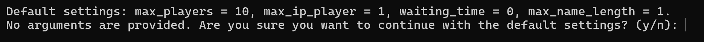
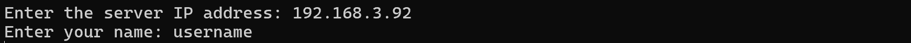
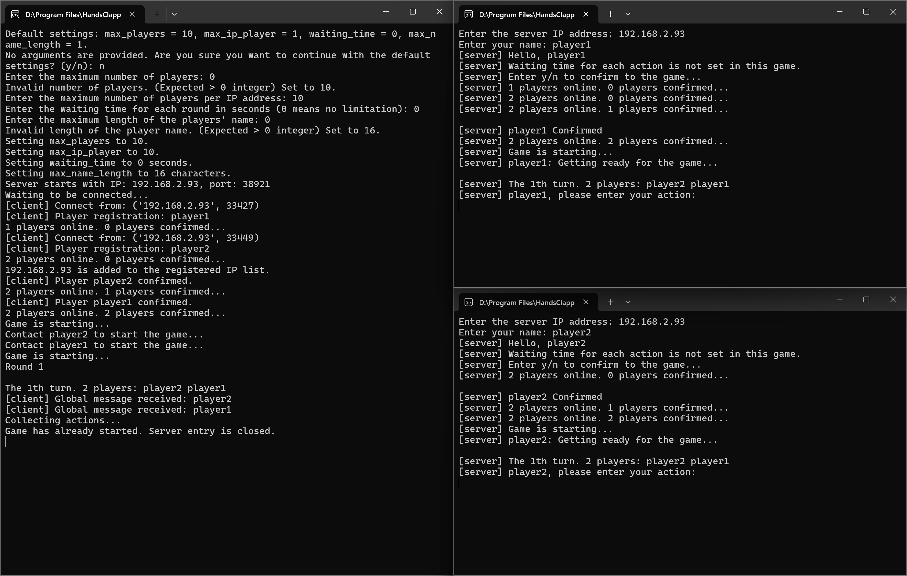

# Game Tutorial

## Rules

If you already know well about the rule of Handsclapping game, you can go on to the next part about Input and Action Syntax.

Coming out soon.

## Input and Action Syntax

This part aims to teaches you how to enter your actions in the battle. Each action has one formal name and a few nicknames. The formal name, such as **PRODUCE**, **PISTOL**, **SHIELD** will be used when showing the battle field information, such as showing you others' action after each round.

When input your action, you can choose one arbitrary nickname or formal name of the action you want, for example, `.` and `qi` for **PRODUCE**, `dia` for **PISTOL**, `$` and `papapa` for **DUPLICATOR** and so on. However, as a punishment, any wrong action name input will be treat as action **NONE**, which means you do nothing in this round.

If an action needs to be implemented more than one time, you are permitted to attach the nickname behind the repeated time number. For example, `2dia` means **PISTOL** for 2 times.

In battle with more that 2 players, it's important to set the target of your action, otherwise it will be treated as to all and may consume much more energy than you expected. Two approaches of setting target is provided, including by name or by index.

Since user name is guaranteed to be unique in the game, you way set the target by players' names. For example, the command for **PISTOL** 2 times to player **name1** is `2dia->name1`.

When the player's name is too long or complex to type, you can also set the target by its index in the game. At the beginning of each round, the players alive will be printed in the order of index, starting from 1. For example, in the following image, the indices for player Alice, Bob, and Charley are 1, 2, and 3 respectively.


Then, the command for **PISTOL** 3 times to player Bob can also be `3dia->#2`.

Input such as `dia->Alice,dia->Bob` and `2dia->#1,3dia->Charley` is also supported. Attention that there should not be space around `,`.

The nicknames for each action is given by the table below. You may also look them up in [`src/game/define_actions.cpp`](game/define_actions.cpp).

***TODO: table*** coming out soon

## Offline Mode

Three modes for offline game are provided if you construct the project locally by the code provided in the repository, including **game mode**, **debug mode**, and **referee mode**, in which game mode implements the basic function of Handsclapping game (multi-player battle is supported), while the debug mode provides more detailed information about the battle field and players which is nontransparent for players in game mode, such as each player's energy and health. The referee mode, instead of providing a battle environment, judges the outcome of two against actions, with no restriction on energy.

However, only **game mode** and **referee mode** are provided in the releases.

To run these modes, please run the corresponding executable files in `bin/game` in your installation path.

## Online Mode

> **REQUIREMENT**\
> The device must have its 38921 port available, or recompiling locally with port editing is needed.
> Current online mode can only support internet connection within LAN.

To launch online mode, you can either run files `python/server.py`, `python/server.py` by your local python3 interpreter or directly run executable files `bin/online/server.exe`, `bin/online/client.exe`. More detailed introduction to online mode is given below.

The online mode bases on the client-server structure, in which each player runs a client program on their device which are connected to an identical server program. Typically, one of the players needs to run client and server program at the same time.

> [!WARNING]
> The current activities of all players, including their actions, energies, healths is transparent to the server program but not to client program, according to the rule of the game. So if the person who launches the server is also in the battle with another client program, you'd better find the one you trust and make sure that they doesn't cheat by the information from the server program.

### How to launch the server

As mentioned above, running `.py` file and executable file are both supported. For example, (in the installation directory)

``` powershell
> python3 ./python/server.py
```

or

``` powershell
> ./bin/online/server.exe
```

or simply click the executable file `bin/online/server.exe` in GUI.

Then you are required to set the arguments for server, including maximum player number, maximum players number from the same IP address, waiting time for players to decide their action, and the maximum length of usernames. The default value is provided as the image shows. You can use them directly by enter `y` or set custom value by enter `n`.



The program will require you to enter the custom argument respectively if `y` is entered. The arguments are all `int` type.

There's another convenient way to launch the server with few custom arguments, through the command line. In the command line, you are expected to launch the server as below:

``` powershell
> python3 ./python/server.py -player <max_players> -ip <max_ip_player> -wait <waiting_time> -name <max_name_length>
```

or

``` powershell
> ./bin/online/server.exe -player <max_players> -ip <max_ip_player> -wait <waiting_time> -name <max_name_length>
```

Where the four argument can in arbitrary order and any one can be omitted. For instance, if a server with argument `<max_players>`=5 is needed, the corresponding command is

``` powershell
> ./bin/online/server.exe -player 5
```

After launching the server program successfully, it will shows it's IP address, which will be used by the clients to get connection with it.

### How to launch the client

Similar to launching the server, running `.py` file and executable file for client are both supported:

``` powershell
> python3 ./python/client.py
```

or

``` powershell
> ./bin/online/client.exe
```

or simply click the executable file `bin/online/client.exe` in GUI.

The client program requires two arguments, which are the IP address of server and your username, as shown in the image below.



You can also set the arguments conveniently in the command line.

``` powershell
> python3 ./python/client.py 192.168.3.92 username
```

or

``` powershell
> ./bin/online/client.exe 192.168.3.92 username
```

Attention that the order of arguments for client can't be changed.

After the connection is established successfully, in-time player number will be shown and the serve will require you to confirm to join the game. Enter `y` or type backspace directly means that you have get prepared for the game and this message can't withdraw. The game will start after all the players send their confirmation.

Finally, enter your actions and have fun!


